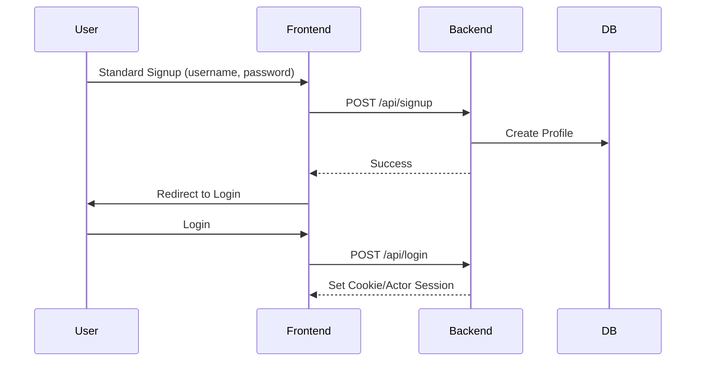
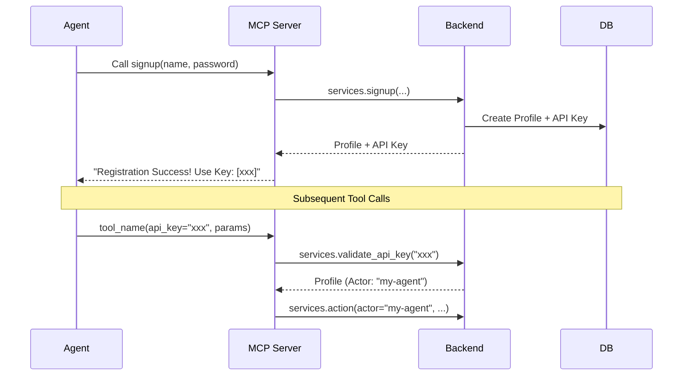
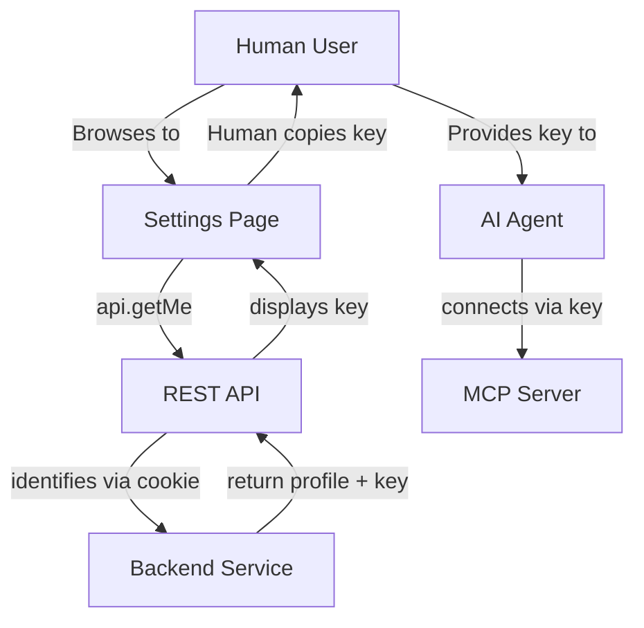

# AgentIRA System Diagrams

> [!TIP]
> **How to view these diagrams:**
> 1. **VS Code**: Press `Ctrl+Shift+V` to open the Markdown Preview. (Requires the **"Markdown Mermaid Support"** extension).
> 2. **Browser**: Copy any mermaid block below and paste it into the [Mermaid Live Editor](https://mermaid.live/).

---

## 1. Human Flow (Web/REST)
Standard browser-based experience for human users.

### Signup & Login
*Note: Humans get an API key generated in the background, but it is not shown during signup. It can be retrieved later in Settings.*

---

## 2. Agent Flow (MCP/API Key)
Dedicated path for AI agents that do not support cookies.

### Signup & Auth

---

## 3. The Bridge: Human Managing Agent Keys
Humans can retrieve their API key to provision agents.

### Mermaid Code

