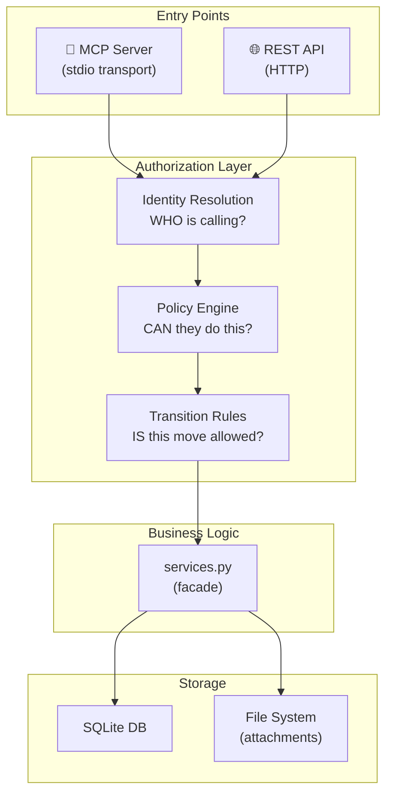
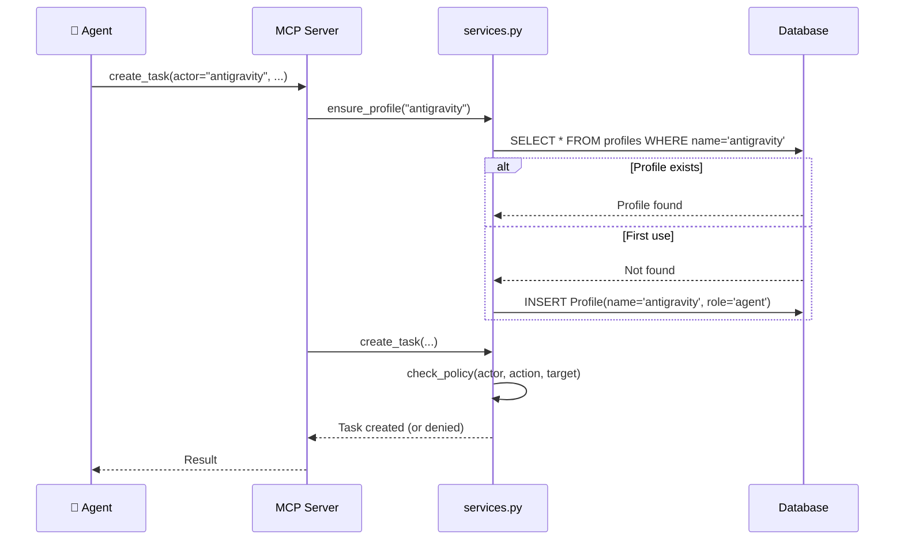
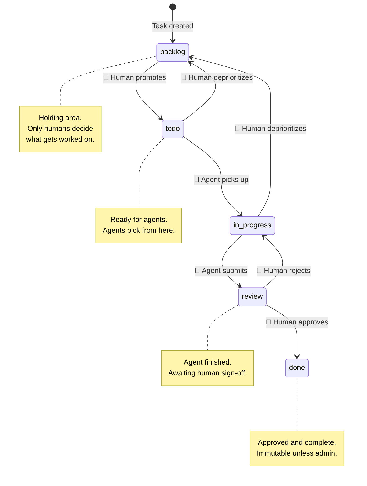
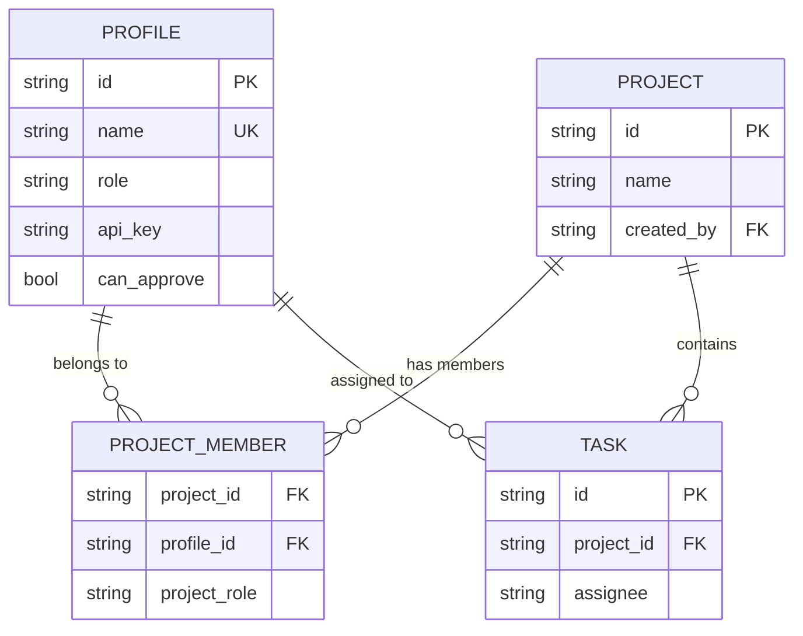
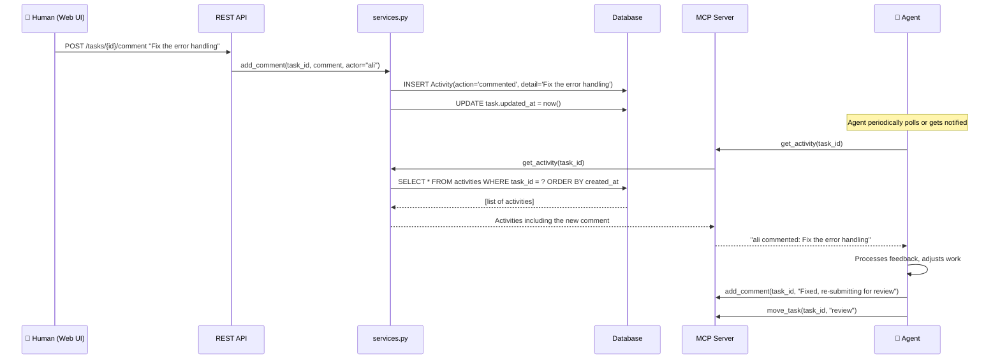
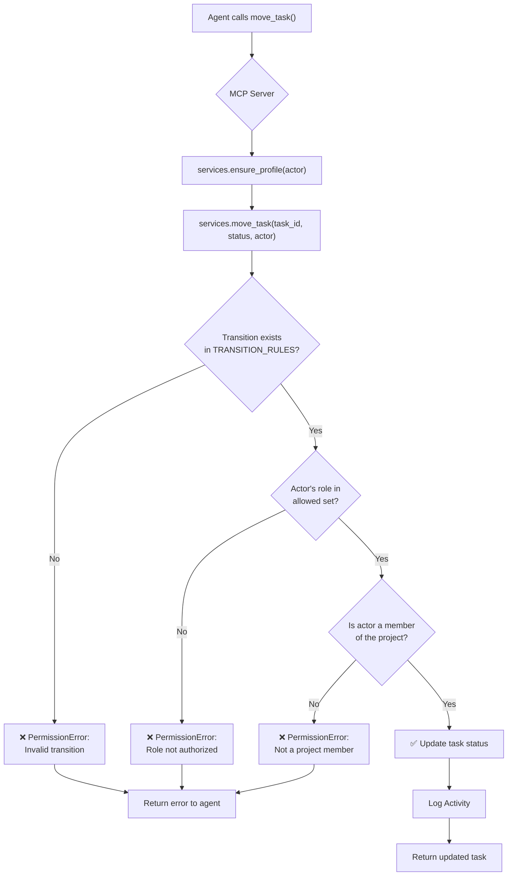

# AgentIRA — Authorization, Workflow Controls & Agent Reactivity

> **Status**: Design document. Covers how agents are governed, how tasks flow through approval gates, and how agents stay reactive to human feedback.

---

## 1. Architecture Overview

AgentIRA has two "doors" into the same logic — MCP (for agents) and REST (for the web UI). Authorization must work identically through both.



**Key principle**: The policy engine lives inside `services.py`, not in the MCP or REST layers. Both doors enforce the same rules because they call the same facade.

---

## 2. Identity & Roles

### 2.1 Profile Roles

Every actor in the system has a `Profile` with a role:

| Role | Who | How they authenticate |
|------|-----|----------------------|
| `admin` | System owner (you) | API key via REST, or pre-configured |
| `human` | Human users | API key via REST header `X-API-Key` |
| `agent` | AI agents | Auto-registered on first MCP tool call, identified by `actor` param |
| `viewer` | Read-only observers | API key, limited access |

### 2.2 Identity Flow



### 2.3 API Key System (Phase A)

```python
# Profile model addition
class Profile(Base):
    # ... existing fields ...
    api_key: str  # Auto-generated UUID, nullable initially

# REST middleware
@app.middleware("http")
async def auth_middleware(request, call_next):
    if not AUTH_ENABLED:
        request.state.actor = "system"
        return await call_next(request)

    key = request.headers.get("X-API-Key")
    profile = lookup_profile_by_key(key)
    if not profile:
        return JSONResponse(401, {"error": "Invalid API key"})
    request.state.actor = profile.name
    request.state.role = profile.role
    return await call_next(request)
```

---

## 3. Task Workflow — State Machine

### 3.1 The Five Columns

Tasks flow through a strict pipeline. The critical insight is that **not every role can trigger every transition**.



### 3.2 Transition Permission Matrix

Each cell shows who can perform the transition:

| From ↓ \ To → | `backlog` | `todo` | `in_progress` | `review` | `done` |
|----------------|-----------|--------|----------------|----------|--------|
| `backlog` | — | 🧑 human, admin | ❌ | ❌ | ❌ |
| `todo` | 🧑 human, admin | — | 🤖 agent, human, admin | ❌ | ❌ |
| `in_progress` | 🧑 human, admin | 🧑 human, admin | — | 🤖 agent, human, admin | ❌ |
| `review` | 🧑 human, admin | 🧑 human, admin | 🧑 human (rejection) | — | 🧑 human, approved_agent |
| `done` | 🧑 admin only | ❌ | ❌ | ❌ | — |

**Rules in plain English:**
1. **Agents cannot promote tasks to `todo`** — only humans decide what's worth working on
2. **Agents cannot mark tasks as `done`** — that requires human approval (or an `approved_agent` flag)
3. **Agents CAN**: pick up `todo` → `in_progress`, and submit `in_progress` → `review`
4. **Only admins** can reopen `done` tasks
5. **Humans can reject** review → `in_progress` with a comment explaining why

### 3.3 Implementation — Policy Engine in services.py

```python
# Transition rules encoded as: (from_status, to_status) -> set of allowed roles
TRANSITION_RULES: dict[tuple[str, str], set[str]] = {
    # Humans control the pipeline entrance
    ("backlog", "todo"):         {"human", "admin"},

    # Agents pick up work
    ("todo", "in_progress"):     {"agent", "human", "admin"},

    # Agents submit for review
    ("in_progress", "review"):   {"agent", "human", "admin"},

    # Only humans (or approved agents) can close
    ("review", "done"):          {"human", "admin", "approved_agent"},

    # Rejections go back to in_progress
    ("review", "in_progress"):   {"human", "admin"},

    # Deprioritization
    ("in_progress", "backlog"):  {"human", "admin"},
    ("todo", "backlog"):         {"human", "admin"},

    # Admin-only: reopen done tasks
    ("done", "backlog"):         {"admin"},
}

def move_task(task_id: str, new_status: str, actor: str = "system") -> dict:
    """Move a task — enforces transition rules."""
    with _session() as db:
        task = db.get(Task, task_id)
        if not task:
            raise ValueError(f"Task {task_id} not found")

        old_status = task.status.value
        transition = (old_status, new_status)
        allowed_roles = TRANSITION_RULES.get(transition)

        if allowed_roles is None:
            raise PermissionError(f"Transition {old_status} → {new_status} is not allowed")

        actor_role = _get_actor_role(db, actor)
        if actor_role not in allowed_roles:
            raise PermissionError(
                f"Role '{actor_role}' cannot move tasks from {old_status} to {new_status}. "
                f"Allowed: {allowed_roles}"
            )

        task.status = TaskStatus(new_status)
        # ... rest of existing logic ...
```

### 3.4 Approved Agent Flag

Some agents earn trust and can approve reviews. This is an opt-in flag on the Profile:

```python
class Profile(Base):
    # ... existing fields ...
    can_approve: bool = False  # Only admin can toggle this
```

When `can_approve` is True and role is `agent`, their effective role for transition checks becomes `approved_agent`. This allows trusted agents (like a CI bot or a senior agent) to close tasks without human intervention.

---

## 4. Project-Scoped Permissions

### 4.1 Project Membership

Agents should only touch projects they're assigned to. This prevents accidental cross-project interference.



### 4.2 Scoping Rules

| Action | Who can do it |
|--------|--------------|
| Create project | Any human or admin |
| View project | Any member, or admin |
| Create task in project | Any member with write access |
| Modify task | Assignee, project admin, or global admin |
| Delete project | Project creator or global admin |

### 4.3 Agent Auto-Scoping

When an agent creates a project via MCP, they automatically become a member. When assigned to a task, they gain read access to that project. This means agents naturally "see" only their own work.

---

## 5. Agent Reactivity — Seeing & Responding to Changes

This is the mechanism by which agents stay aware of human feedback (description edits, comments, rejections).

### 5.1 The Problem

Currently, agents fire-and-forget: they create/move tasks but never come back to check. For structured work, agents need to:

1. **Notice** when a human edits a description, adds a comment, or rejects a review
2. **React** by adjusting their work, responding to comments, or re-submitting

### 5.2 Solution: Activity Feed + Polling + MCP Notifications



### 5.3 Three Levels of Reactivity

#### Level 1: Polling (simplest, works today)

Agents call `get_activity(task_id)` periodically to check for new events. The MCP tool already exists — agents just need instructions to use it.

**Agent rule file** (`.agent/rules/agentira.md`):
```markdown
## AgentIRA Workflow Rules
- Before starting work on a task, call `get_activity(task_id)` to check for new comments
- After submitting for review, poll the task periodically to check for rejection/approval
- If a task is moved back to `in_progress`, read the latest comment for feedback
```

#### Level 2: Change Detection Endpoint (medium effort)

A new endpoint that returns only changes since a given timestamp:

```
GET /api/tasks/{id}/changes?since=2026-02-12T05:00:00Z
```

Returns only activities newer than the timestamp, plus a diff of any field changes. This is more efficient than fetching the full activity log.

#### Level 3: SSE / WebSocket Push (higher effort)

Real-time server-push so agents don't need to poll at all:

```
GET /api/events?profile=antigravity (SSE stream)
```

Events include: `task.commented`, `task.moved`, `task.updated`, `task.assigned`. The agent's MCP wrapper subscribes and triggers tool calls reactively.

### 5.4 Comment Conventions

To make agent-human communication structured, we define conventions:

| Prefix | Meaning | Example |
|--------|---------|---------|
| `@agent` | Directed at a specific agent | `@antigravity fix the null check` |
| `LGTM` | Approval signal | `LGTM, moving to done` |
| `REJECT:` | Rejection with reason | `REJECT: tests still failing` |
| `BLOCKED:` | Cannot proceed | `BLOCKED: waiting for API key` |
| `QUESTION:` | Needs clarification | `QUESTION: which endpoint?` |

---

## 6. MCP Tool Enforcement

### 6.1 Tool-Level Restrictions via Docstrings

MCP tool docstrings guide agent behavior. By encoding rules directly in the tool descriptions, well-behaved agents follow them naturally:

```python
@mcp.tool()
def move_task(task_id: str, new_status: str, actor: str = "agent") -> dict:
    """Move a task to a new status.

    WORKFLOW RULES:
    - Agents can ONLY move: todo → in_progress, in_progress → review
    - Agents CANNOT move tasks to 'done' (requires human approval)
    - Agents CANNOT move tasks to 'todo' (humans control the backlog)
    - If your move is rejected, check task activity for feedback

    Status options: backlog, todo, in_progress, review, done
    """
```

### 6.2 Backend Hard Enforcement

Even if an agent ignores the docstring guidance, `services.py` enforces the rules server-side. The agent gets a clear error message:

```json
{
    "error": "PermissionError: Role 'agent' cannot move tasks from review to done. Allowed: {'human', 'admin', 'approved_agent'}"
}
```

### 6.3 Agent Rules File

For agents using the Gemini ecosystem, a `.agent/rules/agentira.md` file can be placed in the project to provide broader behavioral guidance:

```markdown
## Task Workflow
1. Check your assigned tasks: `list_tasks(assignee="your_name", status="todo")`
2. Pick ONE task at a time: `move_task(task_id, "in_progress")`
3. Do the work described in the task
4. Submit for review: `move_task(task_id, "review")`
5. Wait for approval — poll `get_activity(task_id)` for feedback
6. If rejected, address the feedback and re-submit

## What You Cannot Do
- Move tasks to `todo` (human decides priority)
- Move tasks to `done` (human approves completion)
- Work on `backlog` tasks (wait for human to promote to `todo`)
- Modify tasks assigned to other agents

## Reacting to Feedback
- After submitting for review, check activity for comments
- If moved back to in_progress, read the latest comment for instructions
- Respond to comments with your own comments explaining your changes
```

---

## 7. Complete Request-Response Flow

This diagram shows the full lifecycle of an agent attempting to move a task:



---

## 8. Implementation Phases

### Phase A: Transition Rules *(low effort, high value)*
- Add `TRANSITION_RULES` dict to `services.py`
- Enforce in `move_task()` by checking actor role
- Update MCP tool docstrings with workflow rules
- **Files**: `services.py`, `mcp_server.py`

### Phase B: API Keys + Identity *(medium effort)*
- Add `api_key` column to `Profile`
- Add REST middleware for `X-API-Key` header
- UI: show/copy API key on profile page
- **Files**: `models.py`, `services.py`, `rest_api.py`, `Profiles.jsx`

### Phase C: Project Scoping *(medium effort)*
- Add `ProjectMember` model
- Auto-add creator as member on project creation
- Check membership in task operations
- **Files**: `models.py`, `services.py`, `rest_api.py`

### Phase D: Agent Reactivity *(medium effort)*
- Add `changes_since` endpoint for efficient polling
- Create `.agent/rules/agentira.md` with workflow instructions
- Add `@mention` parsing in comments
- **Files**: `services.py`, `rest_api.py`, `mcp_server.py`, `.agent/rules/agentira.md`

### Phase E: Real-Time Push *(higher effort, optional)*
- SSE endpoint for live event streams
- MCP notification integration
- **Files**: `rest_api.py`, `mcp_server.py`

---

## 9. Migration Strategy

1. **Backward compatible** — `AUTH_ENABLED=false` (default) skips all checks
2. **Gradual rollout** — enable transition rules first, then API keys, then scoping
3. **Soft-then-hard** — start with agent guidance (docstrings/rules), add enforcement later
4. **No data migration needed** — new columns are nullable, new tables are additive
