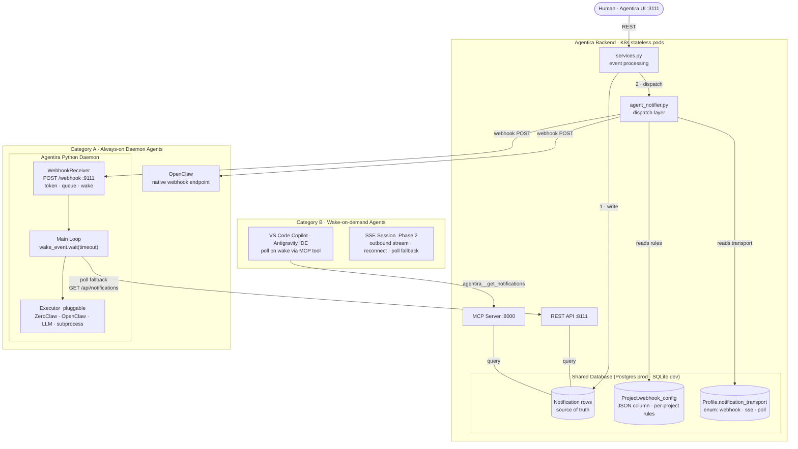
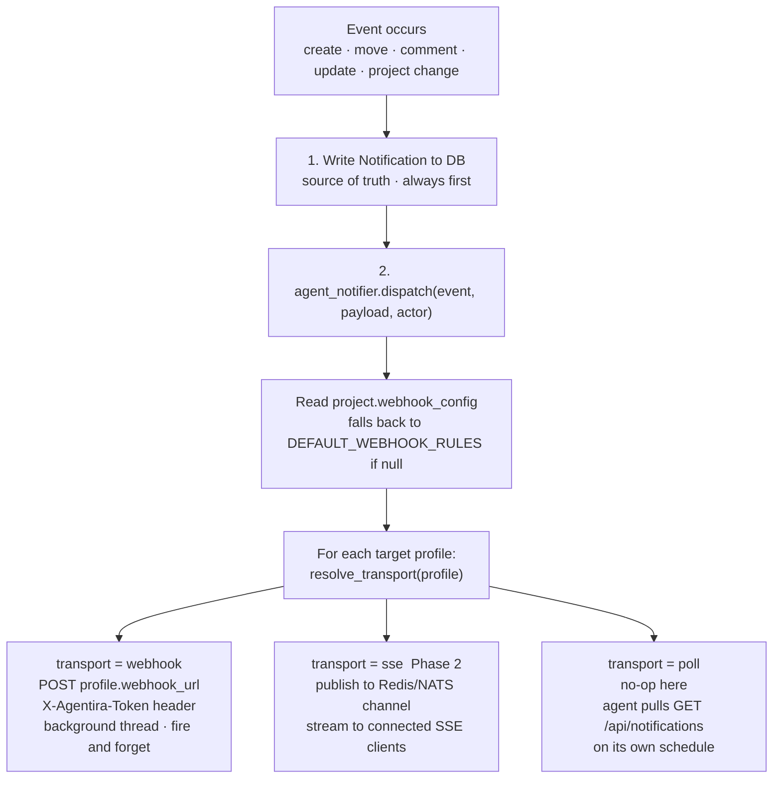
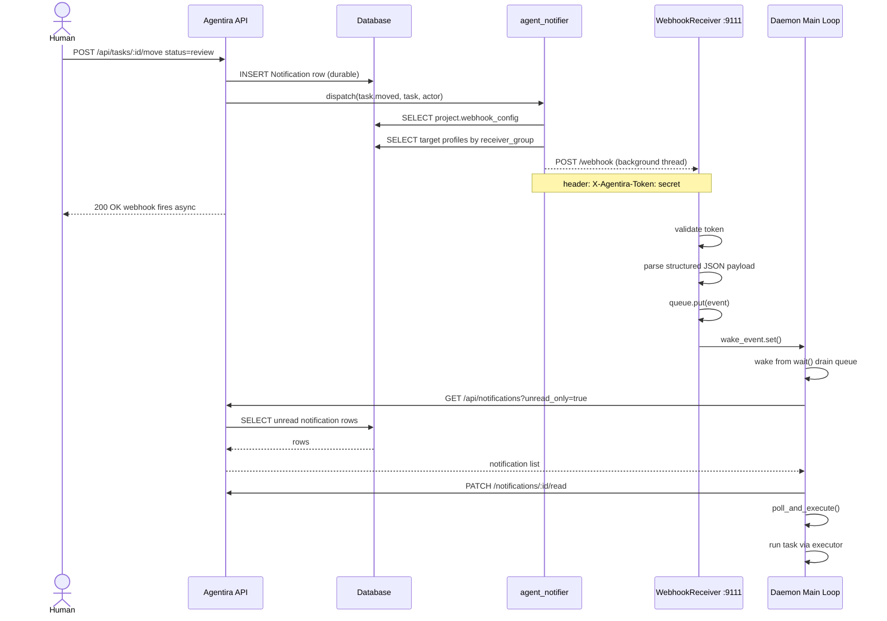
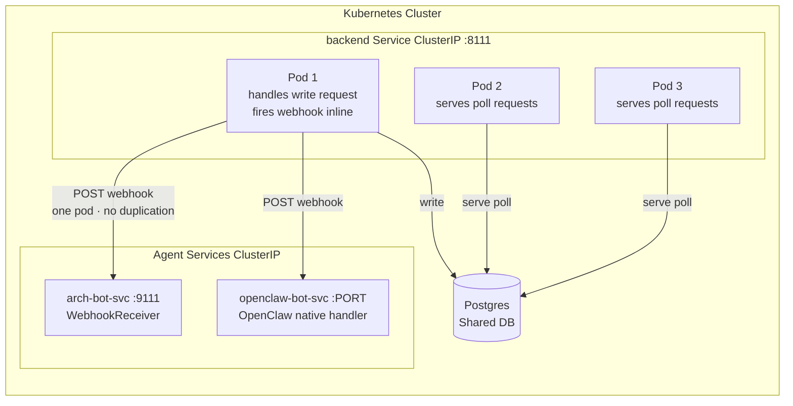
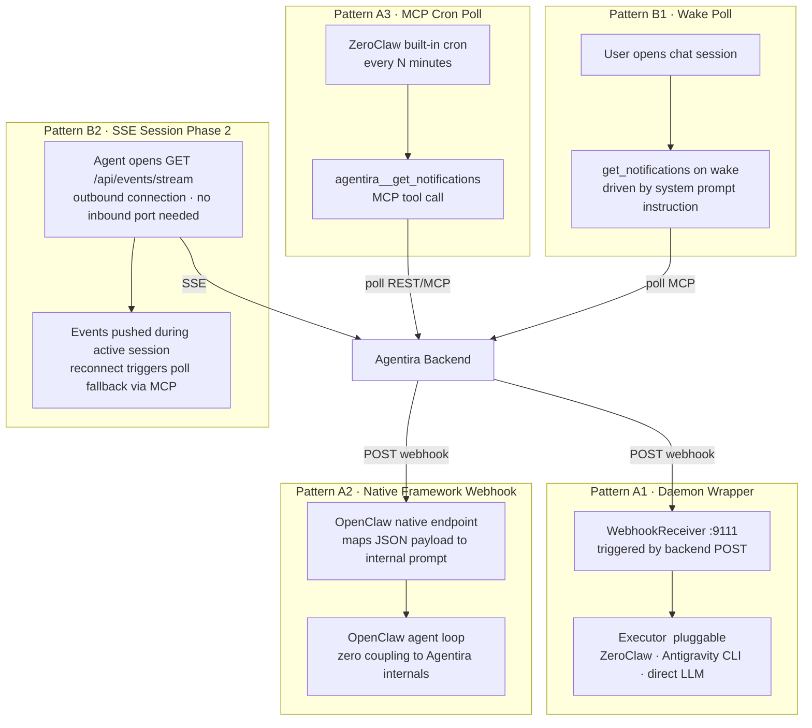

# Continuous Execution Architecture

Describes the push-based agent notification system that enables always-on daemon agents
(ZeroClaw, OpenClaw, custom) and wake-on-demand agents (VS Code Copilot, Antigravity)
to react to Agentira platform events in real time.

See [ADR-007](./architecture_decision_record.md) for the full decision record.

---

## 1. System Overview



---

## 2. Notification Dispatch Flow



---

## 3. Webhook Delivery Sequence



---

## 4. Kubernetes Topology



> **Why webhooks work in K8s without a broker:** each API request is handled by exactly
> one pod. That pod writes the notification and fires the webhook inline — one fire, no
> duplication. The notification row is the durable fallback; any pod can serve the poll.
>
> **Why SSE needs a broker in K8s:** SSE connections live on one pod. An event on Pod 2
> cannot reach a client connected to Pod 1 without a shared pub/sub backbone
> (Redis / NATS). This is why SSE is deferred to Phase 2.

---

## 5. Agent Integration Patterns



| Pattern | Example frameworks | Inbound port | Push latency | Phase |
|---|---|---|---|---|
| A1 · Daemon wrapper | ZeroClaw, Antigravity CLI, custom | yes :9111 | sub-second | 1 |
| A2 · Native webhook | OpenClaw | yes (framework port) | sub-second | 1 |
| A3 · MCP cron poll | ZeroClaw built-in cron | no | N minutes | 1 — works today |
| B1 · Wake poll | VS Code Copilot, Antigravity IDE | no | next user interaction | 1 |
| B2 · SSE session | Any (Phase 2) | no | sub-second | 2 |

---

## 6. Data Model

### Project.webhook_config  (Text / JSON column, nullable)

If `null`, the dispatch layer applies `DEFAULT_WEBHOOK_RULES` (constant in
`agent_notifier.py`). No DB row needed for the default — changing defaults is a
code deploy, not a migration.

```json
{
  "enabled": true,
  "rules": [
    { "event": "task.assigned",      "receivers": "assignee" },
    { "event": "task.moved",         "receivers": "assignee" },
    { "event": "task.commented",     "receivers": "assignee" },
    { "event": "task.created",       "receivers": "bots"     },
    { "event": "task.updated",       "receivers": "assignee" },
    { "event": "project.updated",    "receivers": "bots"     },
    { "event": "project.member.add", "receivers": "assignee" }
  ]
}
```

**Receiver groups:**

| Value | Who receives the event |
|---|---|
| `assignee` | The task's current assignee field |
| `bots` | All project members with `role = bot` |
| `members` | All project members regardless of role |

**Expansion path (no migration needed):** add `"condition"` or `"profiles"` keys to
individual rules as needed. When a proper `webhook_rules` table is warranted (cross-project
queries, per-rule metrics), the JSON schema maps directly to table columns.

**Validation:** `WebhookRule` and `ProjectWebhookConfig` Pydantic models validate the
JSON at the service layer before persistence and before dispatch.

---

### Profile.notification_transport  (Enum column, nullable)

```python
class NotificationTransport(str, enum.Enum):
    WEBHOOK = "webhook"
    SSE     = "sse"      # column exists now; dispatch logic ships Phase 2
    POLL    = "poll"
```

Resolution:

```python
def resolve_transport(profile) -> NotificationTransport:
    if profile.notification_transport:      # explicit always wins
        return profile.notification_transport
    if profile.webhook_url:                 # derive from URL presence
        return NotificationTransport.WEBHOOK
    return NotificationTransport.POLL       # safe default
```

---

### Webhook payload — structured fields only

No `message` field. Task titles, descriptions, and comments are user-supplied content.
Pre-composing them into a freeform string is a prompt injection vector. The receiving
agent constructs its own sanitised context from the structured fields.

```json
{
  "event":      "task.moved",
  "task_id":    "abc123",
  "task_title": "Add login page",
  "project_id": "xyz789",
  "status":     "review",
  "priority":   "high",
  "actor":      "alice",
  "timestamp":  "2026-03-06T18:00:00+00:00"
}
```

For project-level events (`project.updated`, `project.member.add`), `task_id` is
omitted and `project_id` is the primary identifier.

---

### Daemon webhook receiver config  (agents/config.yaml)

Subscription rules live in the backend DB (project.webhook_config), not in the daemon.
The daemon YAML only carries the receiver-side settings:

```yaml
webhook:
  port: 9111    # 0 = disabled
  token: ""     # shared secret; empty = no auth (safe for localhost)
```

---

## 7. Implementation Phases

| Phase | Deliverables | Unlocks |
|---|---|---|
| **1a — Backend webhook infra** | `webhook_config` + `notification_transport` columns · Pydantic models · `get_webhook_targets()` · `notify_many()` · expanded events · webhook config REST endpoints | OpenClaw live via native webhook |
| **1b — Daemon webhook receiver** | `agents/webhook_receiver.py` · interrupt-aware sleep in daemon · YAML config | ZeroClaw + custom daemons via push |
| **1c — Poll fallback** | Daemon notification poll loop using existing `/api/notifications` | Resilience — no missed events |
| **2 — SSE** | Redis/NATS backbone · `GET /api/events/stream` · SSE client in Cat B agents | Sub-second push for VS Code / Antigravity during active sessions |
