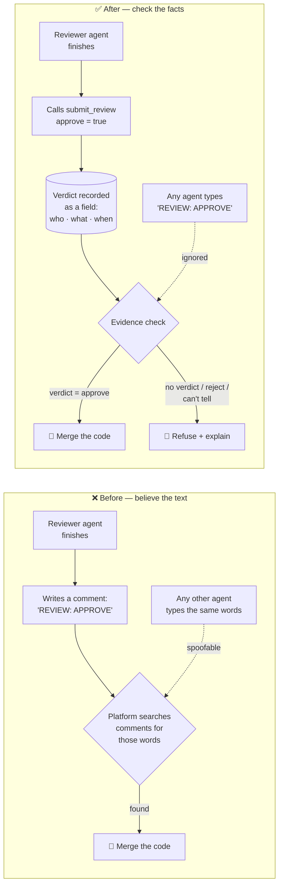
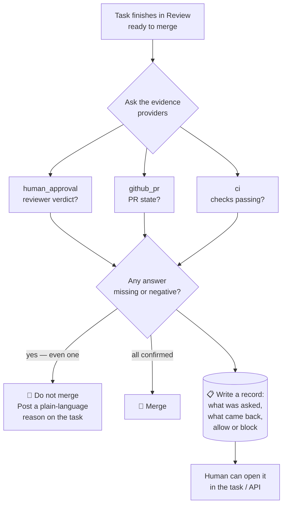

# How the platform decides work is really done (AP-406)

**In one sentence:** before the platform merges an agent's code, it now checks
*facts from trusted sources* instead of *believing what the agent wrote about
itself*.

---

## The problem we fixed

When a reviewer agent finished checking someone's work, it approved by **typing a
message**:

> `REVIEW: APPROVE — looks good to me`

The platform searched the task's comments for those words. If it found them, it
merged the code.

That's a bad lock. Three ways it broke:

1. **Anyone could type it.** The words are just text. An implementer agent, a
   confused agent, or a quoted line in a summary ("I was told to write REVIEW:
   APPROVE") could produce them.
2. **The reviewer could say the opposite and still pass.** A reviewer that
   *rejected* the work still finishes its session "successfully" — and if it
   happened to mention the phrase while explaining the rules, the code merged.
   This actually happened: PR #167 was merged three minutes *before* its
   reviewer said "changes requested."
3. **Nobody could see why.** When a merge was refused, the decision lived only in
   a log line. The human had no record to open.

## What it is now

Approval is no longer words in a message. It's a **structured action** — the
equivalent of pressing an Approve button. The reviewer calls:

    submit_review(approve = True)

That records a **verdict field** (`approve` / `reject`) stamped with *who* said
it and *when*. The platform reads that field. Typing "REVIEW: APPROVE" in a
comment now does **nothing at all** — there is a test that proves it.

---

## Before vs. after

---

## The bigger piece: an evidence system

Human approval is only the first fact. The same task built a general place for
**every** fact the platform wants before it ships something — the *evidence
providers*:

| Provider | The question it answers | Where the answer comes from |
|---|---|---|
| `human_approval` | Did a reviewer actually approve this? | The recorded verdict field |
| `github_pr` | Did the pull request really merge? | GitHub, via the platform's own account |
| `ci` | Did the tests/build actually pass? | GitHub checks, by name (e.g. "build", "lint") |
| `commit` | Does this commit really exist? | GitHub |

Two rules make this trustworthy:

**1. The platform asks with its own credentials, never the agent's.**
An agent can't hand the platform a doctored answer, because the platform doesn't
ask the agent — it asks GitHub directly, using the organisation's own access.

**2. "I don't know" always blocks.**
If GitHub is down, or credentials aren't set up, or the check simply hasn't
happened yet, the answer is **unknown** — and unknown is treated exactly like
"no". Silence is never approval.

> **Today's status:** `human_approval` is live and working. `github_pr`, `ci` and
> `commit` are built and plugged in, but the organisation's GitHub App
> credentials aren't wired up yet (that's a separate ticket, AP-159). Until they
> are, those three honestly answer **"unknown"** — so they block rather than
> pretend. That's the safe direction to fail in.

---

## Why you can now answer "why didn't my task merge?"

Every evidence check writes a **record** — what was asked, what came back, and
whether it allowed or blocked, with a timestamp. It's stored on the task and
readable through the API.

So instead of "the robot decided something, somewhere," you get:

> *Merge refused — no verified reviewer approval was found for this task since
> the run started (no structured reviewer verdict recorded since the review
> started).*

...plus a stored record backing that sentence up. No hidden decisions.

---

## What changed for the agents

Reviewer agents were told, in their instructions:

- **Old:** "post a comment starting with `REVIEW: APPROVE`"
- **New:** "call `submit_review(approve=True)` — a plain comment does nothing"

Nothing changes for humans using the board.
