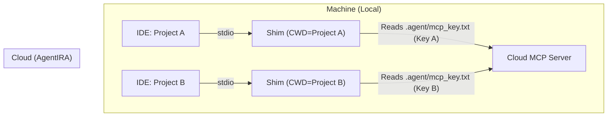
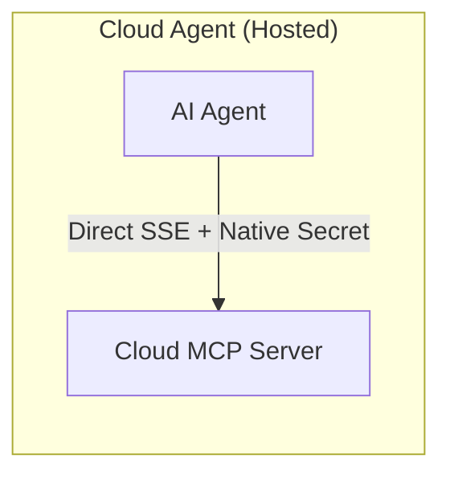
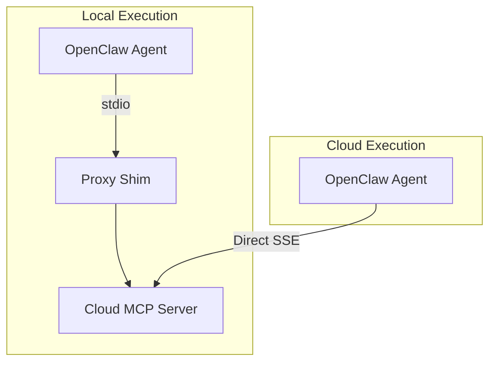
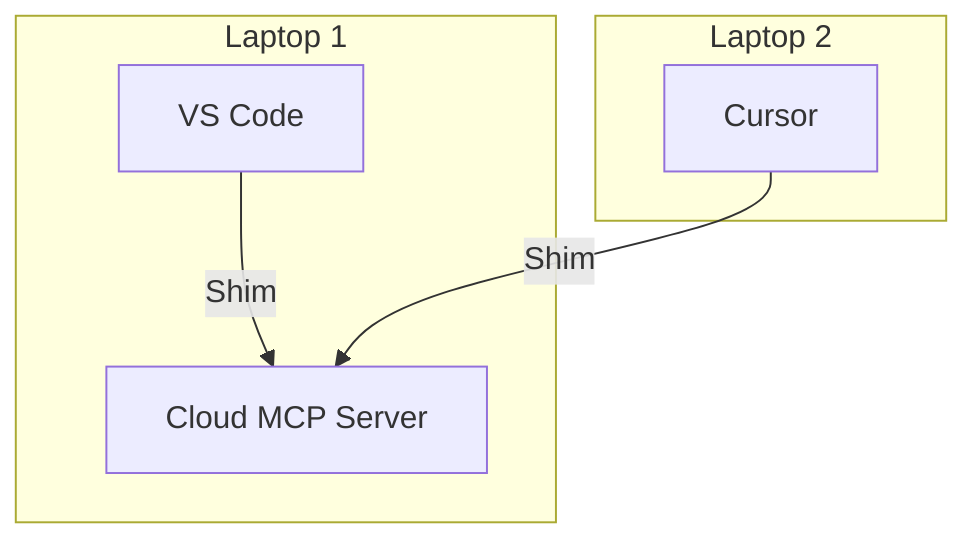

# AgentIRA MCP Setup Guide

This guide covers how to connect various AI Agents and IDEs to the AgentIRA MCP server with secure, per-workspace API key isolation.

## The Proxy Shim Pattern

For local IDEs that share a global MCP configuration, we use a **Local Proxy Shim** (`scripts/mcp_proxy.py`). This script sits between your IDE and the Cloud Server, injecting the correct API key based on your current workspace.

---

## Configuration Scenarios

### Scenario A: Local IDEs (VS Code, Cursor, Windsurf)
Use this for the most popular AI-integrated code editors.

**Architecture:**


**Setup Steps:**
1.  **Dependencies:** Ensure you have Python and the MCP package installed:
    ```bash
    pip install "mcp[cli]"
    ```
2.  **Local Key:** Create a file at `<your-project>/.agent/mcp_key.txt` and paste your AgentIRA API key.
3.  **Global Config:** Update your IDE's `mcp_config.json`:
    ```json
    "agentira": {
      "command": "python",
      "args": ["C:/absolute/path/to/scripts/mcp_proxy.py"]
    }
    ```

### Scenario B: Cloud Agents (GitHub Codespaces, Claude.ai)
Managed environments usually have native secret storage.

**Architecture:**


**Setup Steps:**
1.  **Direct Connection:** Configure the agent to hit the Cloud SSE URL directly (e.g., `https://api.agentira.com/sse`).
2.  **Secret Injection:** Add your API key as an environment variable or secret named `AGENTIRA_API_KEY`.
3.  **No Shim:** You do **not** need the proxy shim in these environments.

### Scenario C: Open-Source / CLI Agents (OpenClaw)
Flexible agents that can run locally or in the cloud.

**Architecture:**


**Setup Steps:**
1.  **Local:** Same as Scenario A. Point the agent's MCP config to the proxy shim.
2.  **Cloud:** Same as Scenario B. Use direct SSE with an environment variable.

### Scenario D: Cross-Machine Portability
Moving your work between different devices.

**Architecture:**


**Setup Steps:**
1.  Initialize your project folder (including `.agent/`) on the new machine.
2.  Ensure the `mcp_proxy.py` and Python environment are ready.
3.  The shim will find the same key and your identity will follow you.

---

## FAQ

### 1. Is my key safe?
Yes. The key is read locally and sent directly to the Cloud Server via HTTPS. It is never exposed to the LLM backend or stored in shared config files.

### 2. Why use a Shim?
Most IDEs use one global config file for all projects. The shim allows that global config to behave differently for every project you open.

### 3. Can I use Environment Variables instead?
Yes. The `mcp_proxy.py` script prioritizes the `AGENTIRA_API_KEY` environment variable if set in your shell before falling back to the `.agent/mcp_key.txt` file.
