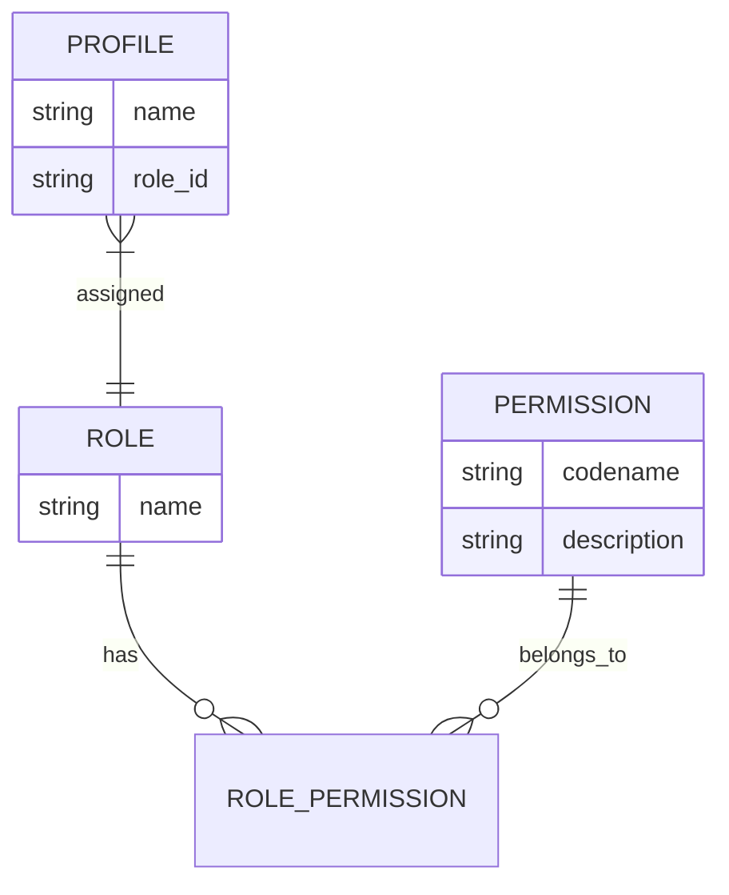
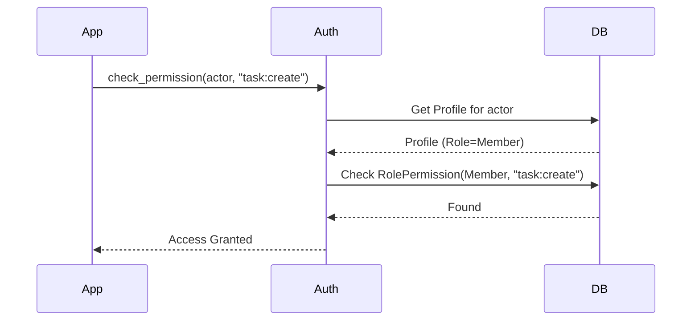

# Role-Based Access Control (RBAC) Guide

AgentIRA uses a robust Role-Based Access Control (RBAC) system to manage permissions across profiles and service accounts.

## 1. User Guide: Managing Permissions

Administrators can manage the system's security posture through the **Settings** menu.

### Managing Roles
1. Navigate to individual profile via sidebar (Management mode) -> **Security**.
2. You will see a matrix of **Roles** (e.g., ADMIN, MEMBER, BOT) and their associated **Permissions**, grouped by functional area.
3. **Toggle Permissions**: Click on a permission tile to grant or revoke it for that role.
   - **Green**: Permission granted.
   - **Gray**: Permission revoked.

### Creating New Permissions
1. Click the **"Create Permission"** button in the top right of the matrix.
2. Enter a **Codename** (e.g., `project:delete`) and an optional **Description**.
3. The new permission will immediately appear in the matrix for all roles.

---

## 2. Technical Guide: Implementation Details

### Data Model
The RBAC system relies on three core entities:
- **Role**: A named collection of permissions (e.g., `admin`, `member`).
- **Permission**: A unique string (`codename`) representing a capability.
- **RolePermission**: A join table linking Roles and Permissions.
- **Profile**: Associated with exactly one Role.

### Permission Checking Logic
Permissions are verified using the `has_permission(db, actor_name, codename)` function in `backend/auth.py`.

1. **Actor Resolution**: The system identifies the `Profile` based on the provided `actor_name`.
2. **Role Fetching**: It retrieves the `Role` associated with that profile.
3. **Permission Lookup**: It checks if any `RolePermission` entry exists for that role and the target permission `codename`.

### Key Files
- `backend/models.py`: Defines `Role`, `Permission`, and `RolePermission` schemas.
- `backend/auth.py`: Contains `has_permission` and `check_transition` middleware logic.
- `backend/services.py`: Implements CRUD operations for roles and permissions.
- `backend/rest_api.py`: Exposes endpoints for the RBAC UI.

### Actor Context
The system uses `actor_ctx` (a `ContextVar`) to propagate the authenticated user across the application without passing it through every function call. This ensures that even background tasks or deep service calls can reliably verify permissions.
