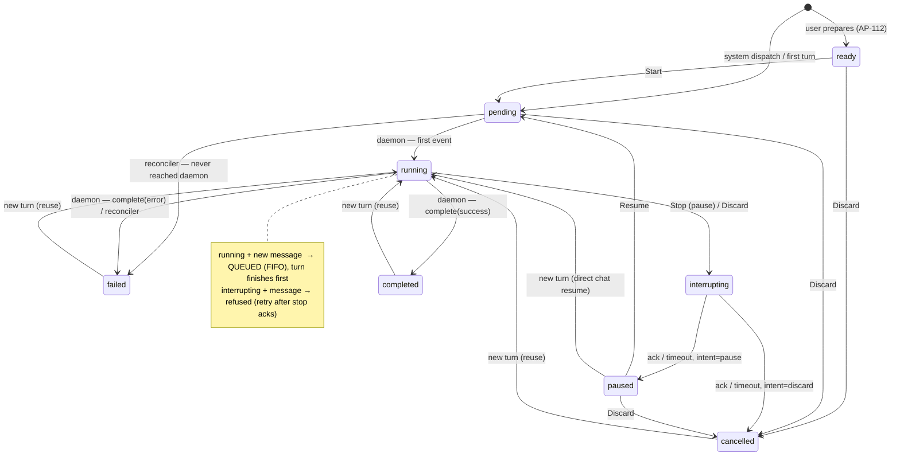

# Run behavior, state machine & test plan (AP-335)

Reviewer-facing reference for how a **Run** behaves, the states it moves
through, and the tests that pin each behavior. Complements
[`run-state-machine.md`](./run-state-machine.md) (the canonical transition
table); this doc adds the Mermaid diagram, the one-run invariant, and the
test-case map.

---

## 1. The core invariant — one run per (agent, task)

A `Run` is the durable **work-view of a task's conversation with one agent**.
There is exactly **one run per `(agent, task)`** — created on the first
dispatch and **reused by every later turn**, whether that turn is a chat
message or an explicit "Run this task". A new turn never creates a second run.

`trigger_event` (`chat` / `task.scheduled`) is **only the label stamped when
the row is first created** — it is never used to decide reuse.

Single source of truth: `runs.get_or_create_task_run` (backend/forge/runs.py)
looks up the latest run for `(agent_id, task_id)` with **no `trigger_event`
filter** and reuses it (resetting it to `running`, clearing the prior verdict,
keeping `session_id` + sticky `is_work`) or creates the first one.

## 2. Two orthogonal fields

Don't conflate these:

| Field | Meaning | Values |
|---|---|---|
| `RunStatus` | process lifecycle | `ready · pending · running · interrupting · paused · completed · failed · cancelled` |
| `RunOutcome` | agent's semantic verdict (via `finish_run`) | `succeeded · needs_input · blocked · failed` |

They combine: a run can be `status=completed` + `outcome=needs_input` (process
exited cleanly, agent is waiting on the user). The UI shows **outcome** as the
primary badge. **"Parked"** ≝ `outcome ∈ {needs_input, blocked}`.

## 3. State machine



**Verified empirically** (AP-335): a new chat turn into `completed`,
`failed`, `cancelled`, `paused`, or `completed+needs_input` always ends at
`n_runs == 1`, `reused == True`, `status == running`. The legacy "terminal
states have no outgoing transition" rule no longer holds under one-run-per-task
— a terminal run is terminal only *until the next turn*, which revives the same
row (a "Restart" is therefore a reuse, not a new run).

## 4. What an incoming message/turn does

`send_runtime_message(scope_key="task:<id>")` routes by the single run's state:

| Single run's state | Behavior | Run count |
|---|---|---|
| `interrupting` (stop in flight) | refuse cleanly; user retries after ack | 1 |
| `running` | **queue** (FIFO); current turn finishes uninterrupted, queued msg dispatches on terminal | 1 |
| `paused` / parked, **direct chat** | **resume**: flip → `running`, clear verdict; returns `resumed_run_id` (UI badge) | 1 |
| any other terminal (`completed`/`failed`/`cancelled`), chat | **reuse** the run as the next turn (via `get_or_create_task_run`) | 1 |
| no run yet | create THE run | 1 |

## 5. The comment-wake safety

A **comment** (`@mention`, or the project's wake-on-comment toggle) must not
flip a *parked/paused* run back to `running` — a passing comment shouldn't look
like it drove real work. Crucially, the safety must **create no run** (an
earlier attempt opened a separate run, which violated the one-run invariant).

`_deliver_comment_to_agent` (backend/services.py) calls
`runs.latest_task_run_is_parked(agent_id, task_id)`:

- **parked / paused** → record the comment as **context**
  (`record_task_comment`: a USER message in the `task:<id>` scope — *no
  dispatch, no state change*). The agent sees it on its next turn.
- **non-parked** → reuse the single run as the next turn (normal wake).

So a comment never revives a parked run and never opens a second run.

> Open product question for review: a comment into a `needs_input` run is
> currently a **no-wake** (record-as-context), not an answer that resumes the
> run. Flipping it to "resume the single run" is a one-line change in
> `_deliver_comment_to_agent`, but it reverses the documented "comment never
> revives" safety. Left as record-as-context.

---

## 6. Test plan

Backend tests run against an ephemeral Postgres (testcontainers; Docker must be
running) via the shared `pg` fixture.

```bash
cd backend && ../venv/bin/python -m pytest tests/ -q      # full suite (500 passing)
```

### One-run invariant — `tests/test_ap190_one_run_per_task.py`
- `test_first_call_creates_then_reuses` — first call creates, later calls reuse the same id (count == 1).
- `test_reuse_resets_terminal_verdict_but_keeps_session_and_is_work` — reuse clears `outcome`/`error`, keeps `session_id` + sticky `is_work`.
- `test_distinct_agents_get_distinct_runs` — one run per *(agent, task)*, not per task.

### Chat reuse / the AP-335 bug — `tests/test_chat_during_run.py`
- `test_chat_after_completed_run_reuses_it` — chat after a completed `task.scheduled` run continues the **same** run (same id, `running`, `is_work` sticky); no second run. *This is the bug reproduction.*
- `test_message_during_running_run_is_queued_not_interrupted` — message into a `running` run is queued, turn not interrupted.
- `test_queued_message_dispatches_on_terminal` / `..._survives_discard_then_dispatches` — the queue drains when the turn reaches a terminal state (even on discard).
- `test_message_resumes_needs_input_run` — direct chat into a parked run resumes it (same run_id, outcome cleared).
- `test_message_with_no_active_run_is_plain_chat` — no prior run → opens the task's single run.

### Comment-wake safety — `tests/test_kickoff_and_comment_wake.py`
- `test_mention_comment_does_not_revive_parked_run` — comment into a parked run: parked run untouched, **no second run**, comment recorded as context.
- `test_mention_comment_reuses_completed_run_no_second_run` — wake into a completed (non-parked) run reuses the single run.
- `test_wake_on_comment_toggle_dispatches_plain_comment` — toggle on → plain comment wakes (1 run).
- `test_comment_from_assigned_agent_does_not_loop` — an agent's own comment doesn't re-dispatch itself.

### Explicit prepare path also reuses — `tests/test_ap298_one_run_per_task_prepare.py`
- `test_second_prepare_reuses_the_same_run` — re-preparing reuses the one run.
- `test_prepare_reuses_terminal_run_and_clears_verdict` — re-prepare a finished run in place, clear the verdict.
- `test_prepare_returns_live_run_untouched` — never stacks a duplicate while one is live.

### Manual sanity check
1. Run a task to completion → chat a follow-up → the Runs list still shows **one** run (now `running`, then a terminal state again), not a new entry.
2. On a task parked at `needs_input`, post an `@mention` comment → the run stays parked, **no new run** appears, and the comment shows up as context.
